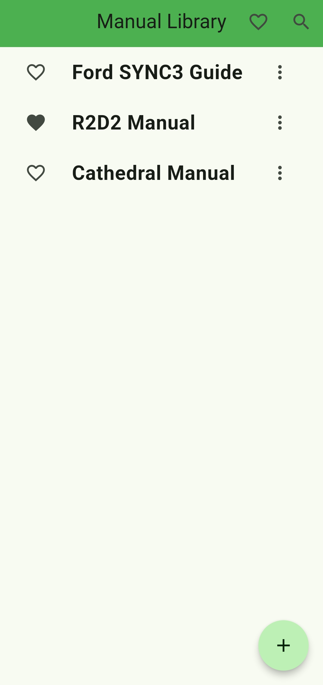
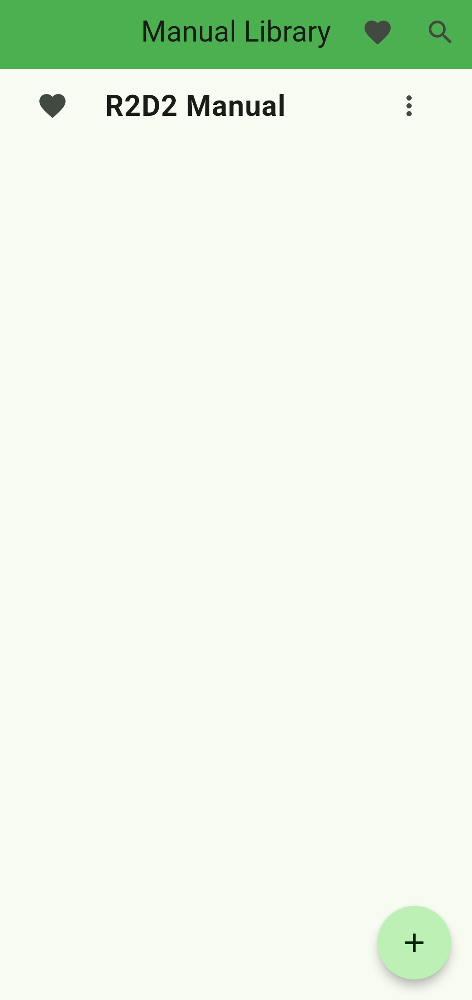

# Manual Library

Android application to store and view PDFs by storing saving only the file path. Initially made to conveniently store Metal Earth kit manuals in one place (hence the name).
Uses sqflite to store file path and chosen name, and syncfusion_pdfviewer to view pdfs.

[Download APK](https://github.com/brbrar/ManualLibrary/releases)

## Done
- Upload and store file path of PDF.
- Lets user choose a custom name for stored 'manual'.
- Can view file info and edit file path.
- CRUD functions.
- Can add favourites.

## To-do
- App customisation features
- PDF thumbnails in list
Web search for PDFs online:
- Allow saving of PDFs via web search.

## Usage
1. Press the floating + button to either upload a PDF from the device or initiate a web search.
2. Upon selecting upload, find the file of your choice and input a custom name.
3. The home screen will include this custom name and PDF, which is viewable upon pressing.
4. The 3 dots button allows viewing of the file info, editing the name and path, and deletion.
5. A manual can be added/removed to/from your favourites by using the heart button next to manual name.
6. View favourites or search for manuals by using the buttons in the top right.

## Screenshots

